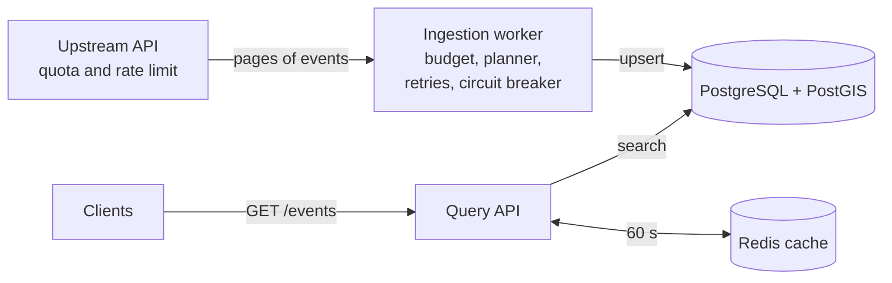

# event-discovery-service

A backend service that answers one question: which events are near a location in a
date range? It gets its events from an API that has a daily quota and a rate limit,
and it continues to answer when that API fails.

The upstream is a local copy of the Ticketmaster Discovery API with the same
documented limits, so each result here comes from a command that you can run
with no API key.

## Results in short

| Question | Result |
|---|---|
| Does ingestion stay in a quota of 5000 calls a day? | Yes. 4499 calls used, 0 calls rejected. A refresh of all regions each hour uses the quota in 10 hours. |
| What happens when one upstream call in five fails? | With retries, 205 region refreshes are successful and 5 fail. Without retries, 59 are successful and 659 fail. |
| How fast does ingestion start again after an outage? | 3.3 minutes on average with the circuit breaker, 33.3 minutes without it. |
| How fast is a search on 1,000,000 events? | P50 2.57 ms and P95 17.06 ms with one combined index. P50 178.35 ms with no index. |
| How much load can the API serve? | 1200 requests a second with a P95 of 11.5 ms and no errors, with the cache. Approximately 600 requests a second without it. |
| Do clients see an upstream outage? | No. 0 errors, and the P95 stays between 11.6 and 13.4 ms. |

Each row has a section below with the full table, the conditions, and the command.

## Architecture



- **Ingestion worker.** It copies events from the upstream to the database. A
  quota budget decides how many calls each cycle can use, and a planner decides
  which regions get them.
- **Query API.** It reads only the database and the cache. It does not call the
  upstream, so an upstream failure does not reach the clients.
- **Simulated upstream.** It has the documented limits of the real API, and it
  can fail on command.

## Quick start

Python 3.12 or later and Docker are necessary.

```
python -m venv .venv
.venv/bin/pip install -e ".[dev]"
docker compose up -d db cache          # PostgreSQL with PostGIS, and Redis, for the tests
.venv/bin/pytest
```

To start all the parts (the simulated upstream, ingestion, the database, the cache
and the API) and then search:

```
docker compose up -d --build --wait
curl 'http://127.0.0.1:8080/events?lat=40.7128&lon=-74.0060&radius_km=10'
```

The first ingestion cycle needs approximately 30 seconds to get all regions.

## Ingestion that stays in the quota

The upstream permits 5000 calls a day. One refresh of all 30 regions uses
approximately 550 calls, so a refresh of all regions each hour needs 13,200 calls
a day. Ingestion must select what to refresh.

One simulated day, 80,000 events, 30 regions, 24 hourly cycles:

| Policy | Calls accepted | Calls rejected | Region refreshes | Mean staleness (h) | Max staleness (h) |
|---|---|---|---|---|---|
| Refresh all regions each hour, no budget | 5000 | 15 | 271 | 5.44 | 15.99 |
| Refresh all regions each 3 hours, no budget | 4351 | 0 | 240 | 1.52 | 2.99 |
| Quota budget (this project) | 4499 | 0 | 270 | 1.59 | 4.00 |

The same day with half the quota, 2500 calls:

| Policy | Calls accepted | Calls rejected | Region refreshes | Mean staleness (h) | Max staleness (h) |
|---|---|---|---|---|---|
| Refresh all regions each hour, no budget | 2500 | 20 | 128 | 8.84 | 20.98 |
| Refresh all regions each 3 hours, no budget | 2500 | 4 | 129 | 4.43 | 14.98 |
| Quota budget (this project) | 2245 | 0 | 131 | 3.26 | 8.00 |

What the tables show:

- The quota budget sends no call that the upstream rejects, at each quota. It also
  keeps the reserve: 4499 calls used of the 4500 that it can spend.
- The hourly refresh with no budget uses the full quota in the first 10 hours. The
  regions then get no refresh until the next day.
- A fixed interval of 3 hours is equal to the budget at 5000 calls (1.52 h and
  1.59 h). But a person must calculate that interval from the quota and the cost.
  With half the quota, the same interval fails, and the budget adjusts with no change.

Staleness is the time since the last refresh of a region. The mean uses the region
weight and a sample each 5 minutes. A region with no refresh yet counts from the
start of the day.

To get the same tables:

```
python benchmarks/quota_day.py
python benchmarks/quota_day.py --quota 2500 --reserve 250
```

The benchmark uses a manual clock, so each command runs in approximately one minute
and each run gives the same numbers.

### How it works

1. **Budget.** `QuotaBudget` counts the calls that remain until the reset. It keeps a
   reserve (500 calls by default) for work outside the schedule. After each response
   it takes the count from the `Rate-Limit-Available` header.
2. **Allowance.** Each cycle gets a share of the calls that remain, in proportion to
   its share of the time until the reset. At the start of the day:
   4500 calls × 3600 s ÷ 86,400 s = 187 calls for the first hour.
3. **Plan.** The planner puts the regions in order of `weight × staleness ÷ cost`,
   where cost is the number of calls that the last refresh of the region used. It
   takes regions in that order until the allowance is used.
4. **Limit.** The client asks the budget before each call. If the budget has no call
   to spend, the client does not send the request.
5. **Pace.** The client sends a maximum of 4 calls a second. The upstream limit is 5.

## Upstream failures

The simulated upstream can fail on command. The same day of hourly ingestion ran
with three clients. All three use the quota budget.

**One call in five fails (HTTP 503) for the full day:**

| Client | Calls | Failed calls | Region refreshes | Failed refreshes | Mean staleness (h) | Max staleness (h) |
|---|---|---|---|---|---|---|
| No retry | 3152 | 659 | 59 | 659 | 10.16 | 24.00 |
| Retry | 4482 | 947 | 205 | 5 | 2.07 | 5.99 |
| Retry + circuit breaker | 4482 | 947 | 205 | 5 | 2.07 | 5.99 |

- Without retries, ingestion almost stops. One failed call fails the refresh of
  its region, and a refresh needs 17 calls on average (4499 calls ÷ 270 refreshes
  in the quota table above). For a region that needs 17 calls, the chance that all are
  successful is 0.8^17 = 2.3 %.
- With a maximum of 4 attempts for each call, 205 refreshes are successful and 5
  fail. The retries go through the quota budget, so the day stays in the quota.
- The breaker did not open (0 times). That is correct: it opens after 5 failures
  in sequence, and it must not stop ingestion for errors that are not in sequence.

**A full outage that starts at 06:20 and continues for approximately 2 hours**
(mean of four runs, with the end at 08:05, 08:20, 08:35 and 08:50):

| Client | Failed calls | Recovery, mean (min) | Recovery, max (min) | Mean staleness (h) |
|---|---|---|---|---|
| No retry | 21 | 33.3 | 55.8 | 1.68 |
| Retry | 84 | 33.3 | 55.8 | 1.70 |
| Retry + circuit breaker | 24 | 3.3 | 3.3 | 1.62 |

- Recovery is the time from the end of the outage to the first refresh. Without
  the breaker, ingestion waits for the next hourly cycle. With the breaker, the
  next cycle starts at the next probe, and the breaker sends a probe at least
  each 5 minutes.
- Retries alone make an outage cost more quota: 84 failed calls. The breaker
  decreases that to 24, which includes the probes.
- The staleness for the day is almost the same for the three clients. No client
  can refresh during an outage.

During an outage the query API continues to answer, because it reads only the
database. Each response has a `refreshed_at` field, so a client can see the age
of the data. A test and the CI smoke test check this.

To get the same tables (approximately 4 minutes):

```
python benchmarks/fault_day.py
```

### How it works

- **Retry.** After HTTP 5xx, a network error, or a rate-limit rejection, the client
  tries again: a maximum of 4 attempts, with exponential backoff and full jitter.
  It does not retry HTTP 4xx or a used quota. Each attempt uses the quota budget.
- **Circuit breaker.** After 5 failures in sequence, the breaker opens and the
  client sends no calls. After 30 seconds, one probe goes through. A successful
  probe closes the breaker. A failed probe opens it again for two times as long,
  to a maximum of 5 minutes. Each probe uses one call of the quota.
- **Saved state.** The worker saves the refresh time and the cost of each region
  in the database. After a restart it continues from that state.

The upstream returns no item after the first 1000 of a search (`size × page < 1000`).
If a region has more events than that, the worker divides the date range into two
halves and gets each half.

## Search in PostgreSQL

The search is "events less than N km from a point, with a start time in a range".
One GiST index on `(location, starts_at)` answers it. I measured that index and four
alternatives on 1,000,000 events with the same 500 searches:

| Indexes | P50 (ms) | P95 (ms) | P99 (ms) |
|---|---|---|---|
| No index | 178.35 | 209.20 | 229.44 |
| B-tree on `starts_at` | 74.35 | 106.41 | 115.58 |
| GiST on `location` | 26.04 | 73.90 | 82.02 |
| GiST on `location` + B-tree on `starts_at` | 5.91 | 22.66 | 38.89 |
| **GiST on `(location, starts_at)`, the index of the service** | **2.57** | **17.06** | **25.37** |

- The index of the service is 69 times faster than no index at P50
  (178.35 ÷ 2.57) and 12 times faster at P95 (209.20 ÷ 17.06).
- An index on only the location or only the time is not sufficient. Each search
  has the two conditions, and the combined index applies them in one index scan.

Conditions: the time is for one search from a Python client on one connection,
with the network time to a local container. Each search has a radius of 5, 10 or
25 km, a range of 1, 3 or 7 days, and a limit of 50 rows. PostgreSQL 17 with
PostGIS 3.6 and the default settings, in a Docker virtual machine with 2 CPUs and
2 GB of memory, on an Apple M3 Pro. The events have 40 venues for each of 30
cities, so many events have the same location. The benchmark does not measure
the cost of the index for writes.

To get the same table:

```
docker compose up -d db
python benchmarks/geo_query.py
```

## Storage and the query API

The events are in one PostgreSQL table. The location is a PostGIS `geography`
point, so a distance is in meters on the WGS 84 spheroid. The worker writes a page
of events with one statement. That statement inserts new events, updates changed
events, and does not write a row that is the same.

```
GET /events?lat=40.7128&lon=-74.0060&radius_km=10&start=2026-01-10T00:00:00Z&end=2026-01-12T00:00:00Z
```

| Parameter | Default | Limit |
|---|---|---|
| `lat`, `lon` | necessary | |
| `radius_km` | 10 | 200 |
| `start` | now | |
| `end` | `start` + 30 days | |
| `segment` | all | |
| `limit` | 50 | 200 |
| `cursor` | first page | |

The response has the events in order of start time, the distance of each event in
km, `next_cursor`, and `refreshed_at` (the last refresh of a region that contains
the point). The cursor holds the start time and the id of the last
event, so a page does not change when new events arrive before it.
`GET /healthz` reports if the database answers.

### The cache

The API keeps each response in Redis for 60 seconds. The `X-Cache` response
header is `hit`, `miss` or `off`.

- **Key.** The API rounds `lat` and `lon` to 4 decimals (approximately 11 m) and
  a default `start` to the minute, before the search. Requests that differ by
  less than that get the same answer and use the same cache entry.
- **Age.** A response from the cache can be 60 seconds old. Ingestion refreshes a
  region 9 times a day on average (270 refreshes ÷ 30 regions), so this adds
  little to the age of the data.
- **One computation for each key.** When a popular entry expires, many requests
  miss at the same moment. One of them reads the database, and the others in the
  same process wait for its result.
- **Redis failure.** If Redis does not answer in 0.1 seconds, the request reads the
  database. The API then does not try Redis for 5 seconds. The Redis client has
  no retries: its default of 3 retries held a request for more than 2 seconds
  in a test.

## Load test and cache

Requests arrive at a fixed rate for 60 seconds, after 60 seconds of warm-up.
The database has 1,000,000 events.

| Requests/s | Cache | Successful/s | P50 (ms) | P95 (ms) | P99 (ms) | Errors | Cache hit rate |
|---|---|---|---|---|---|---|---|
| 400 | no | 400 | 8.2 | 23.9 | 38.8 | 0 | - |
| 400 | yes | 400 | 3.0 | 9.6 | 15.3 | 0 | 83.3 % |
| 800 | no | 595 | 877.0 | 3572.6 | 3762.9 | 12,314 | - |
| 800 | yes | 800 | 2.5 | 10.5 | 17.8 | 0 | 86.1 % |
| 1200 | no | 595 | 845.1 | 3533.6 | 3899.7 | 36,280 | - |
| 1200 | yes | 1200 | 2.6 | 11.5 | 20.7 | 0 | 87.3 % |

- Without the cache, the service has a limit of approximately 600 requests a
  second. At 800 requests a second, 12,314 of 48,000 requests fail (26 %).
- With the cache, 1200 requests a second have a P95 of 11.5 ms and no errors.
  That is the highest rate in the test, so the test did not find the limit with
  the cache.
- At a rate that the two configurations can serve (400 requests a second), the
  cache decreases the P95 from 23.9 ms to 9.6 ms.

**An upstream outage during the load.** Ingestion runs against the simulated
upstream, and the upstream fails each call for the middle 30 seconds of the run.
The API gets 200 requests a second:

| Phase | Successful/s | P50 (ms) | P95 (ms) | Errors |
|---|---|---|---|---|
| Before the outage | 200 | 3.9 | 13.4 | 0 |
| During the outage | 200 | 4.1 | 11.6 | 0 |
| After the outage | 200 | 4.0 | 11.9 | 0 |

The clients see no error and no slower response. The API reads only the database
and the cache, so an upstream failure does not reach it. In this run, 5 calls of
ingestion failed before the circuit breaker opened.

Conditions: the API runs as 4 processes on an Apple M3 Pro. PostgreSQL and Redis
run in a Docker virtual machine with 2 CPUs and 2 GB of memory on the same
computer, and the load generator also runs there. 90 % of the requests come
from 2000 popular searches with a Zipf distribution, and 10 % are searches that
occur one time. The cache hit rate is a property of this workload: a workload
with fewer repeated searches gets a lower rate. The load is open-loop, and a
request that gets no response in 5 seconds is an error.

To get the same tables (approximately 20 minutes):

```
docker compose up -d db cache
python benchmarks/load_test.py --rates 200,400,800,1200
```

## The simulated upstream

`event_discovery.upstream_sim` is a local copy of the event search of the
[Ticketmaster Discovery API](https://developer.ticketmaster.com/products-and-docs/apis/discovery-api/v2/).
It copies the limits that Ticketmaster documents:

- a quota of 5000 calls a day and a rate limit of 5 calls a second
- the `Rate-Limit`, `Rate-Limit-Available`, `Rate-Limit-Over` and `Rate-Limit-Reset`
  response headers
- HTTP 429 with the documented fault body when the quota is used
- the deep paging limit

`PUT /_sim/faults` makes it fail on command: an error rate, an outage between two
times, or a delay before each response.

The events are synthetic, and a seed makes them the same on each run. No API key and
no network are necessary. Four points are my decisions, because the Ticketmaster
documents do not specify them: the quota resets at 00:00 UTC, the rate limit is a
sliding window of one second, a call that the rate limit rejects does not use the
quota, and a call that fails with HTTP 503 does use the quota.

## Limits

- **All results come from one computer.** The API, the database, Redis and the
  load generator ran on one Apple M3 Pro. The ratios are more useful than the
  absolute times.
- **The ingestion results come from simulated time** and synthetic events. The
  Docker smoke test in CI is the check in real time.
- **The upstream is a copy.** It has the limits that Ticketmaster documents. I did
  not run the service against the real API.
- **The cache hit rate comes from a synthetic workload.** A workload with fewer
  repeated searches gets a lower rate.
- **The load test did not find the limit with the cache.** 1200 requests a second
  was the highest rate.
- **The service does not delete events that are in the past.**
- **The breaker state is in the memory of the worker**, so the API cannot report it.
- **The service has no public deployment.** It runs with Docker Compose.

## How the project was built

Five milestones, each one pull request:

1. [Ingestion with a quota budget](https://github.com/yash-bitla/event-discovery-service/pull/1), and the simulated upstream.
2. [Storage, a geospatial index and the query API](https://github.com/yash-bitla/event-discovery-service/pull/2).
3. [Retries, a circuit breaker and fault injection](https://github.com/yash-bitla/event-discovery-service/pull/3).
4. [A cache and a load test](https://github.com/yash-bitla/event-discovery-service/pull/4).
5. This README.

Three measurements changed the design:

- The first schema had only an index on the location. The benchmark showed that
  one index on `(location, starts_at)` is 10 times faster at P50.
- The first planner gave no refresh to a region that cost more than one cycle
  allowance. The one-day benchmark showed a region that waited 14 hours.
- The first load generator was one Python process, and it was the bottleneck at
  approximately 350 requests a second. The generator now uses four processes
  and reports its own delay.

## License

MIT
